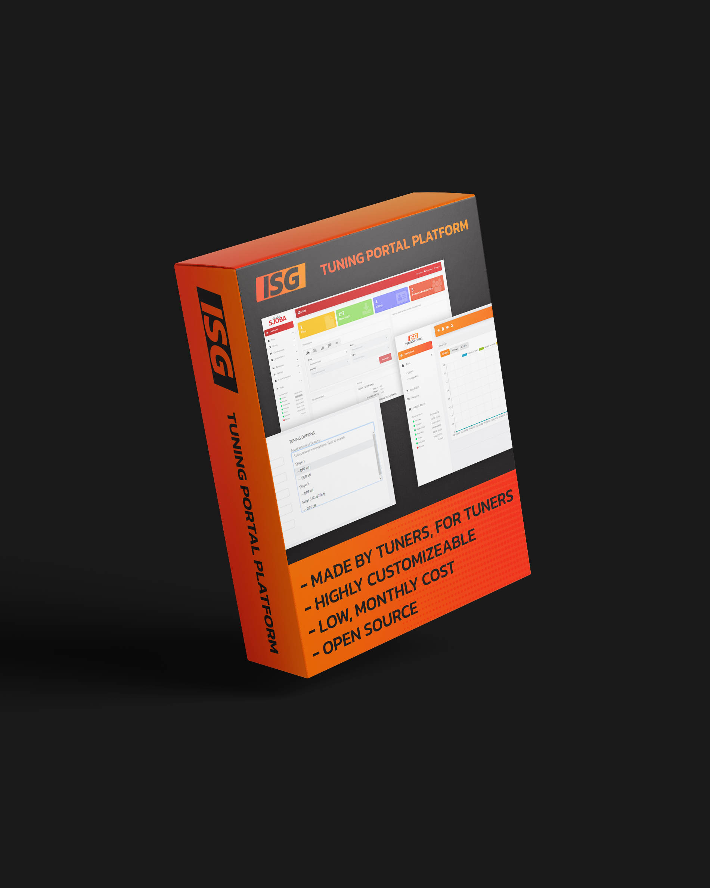
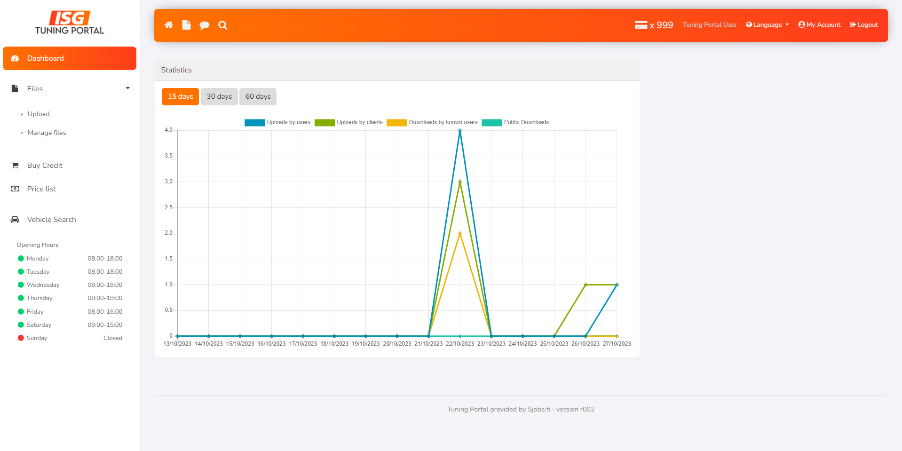
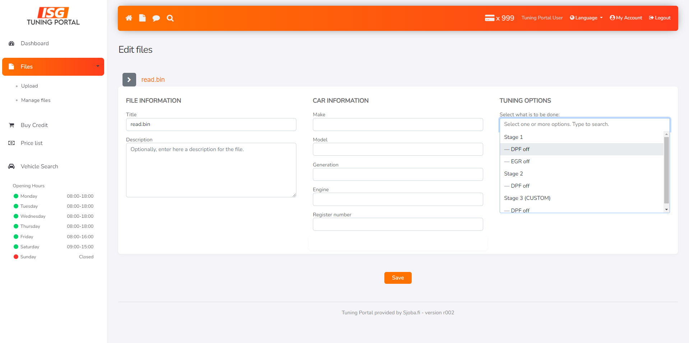
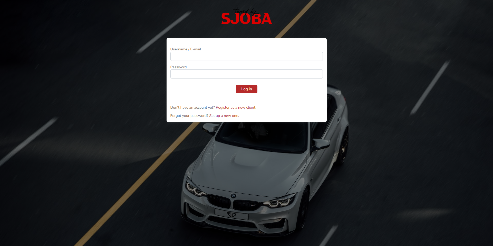
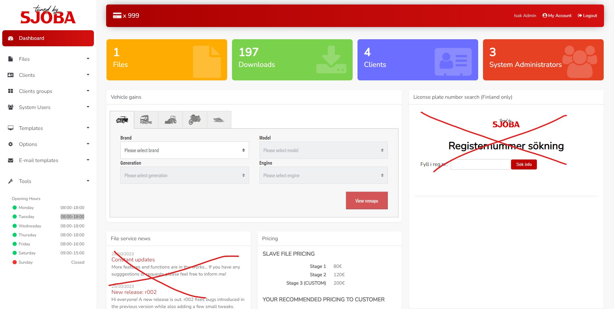

# Welcome to the first ever open source tuning portal!

I am currently working on a file portal system for myself, and thought that since I am already doing some of the work it I might aswell make it open source for the people who can't (yet) justify the big prices of the premade file portals currently availible. The portal is of course highly customizeable!

# Description

This is a file portal system for tuning companies and individuals who offer tuning services, basically an easier way of keeping track of your clients, the files and projects they send you. 

## Features

 - User Management System / Dealer & Clients Panel
 - Credit System
 - Different language options
 - Tuning Methods
- Reading Methods
- **Data for 11 thousand different vehicles**
- Email Notifications
- Modern, highly customizeable interface design

## Screenshots

Here are some screenshots of the interface currently.

## I need this or want to contribute!

You can send me a message, either on [Whatsapp](https://wa.me/358415767696), MHHauto or on [e-mail](mailto:isak@sjoba.fi). The code will not be published publicly until I feel it is ready and safe to do so, so shoot me a message for the time being if you want access!

